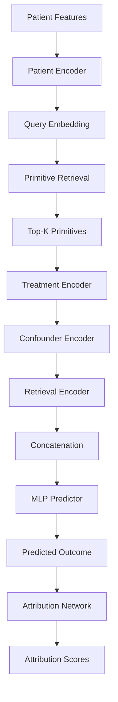
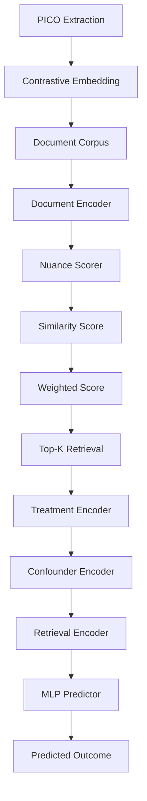

## Model Architecture Diagrams

### Figure 1: Overall System Architecture

```
┌─────────────────────────────────────────────────────────────────────┐
│                    Drug Recommendation System                        │
├─────────────────────────────────────────────────────────────────────┤
│                                                                     │
│  ┌─────────────┐    ┌─────────────┐    ┌─────────────┐              │
│  │   Patient   │    │  Treatment  │    │ Confounders │              │
│  │   Features  │    │   Features  │    │   (EHR)     │              │
│  └──────┬──────┘    └──────┬──────┘    └──────┬──────┘              │
│         │                  │                  │                     │
│         └──────────────────┼──────────────────┘                     │
│                            │                                        │
│                            ▼                                        │
│  ┌─────────────────────────────────────────────────────────────┐   │
│  │              Causal Inference Module                        │   │
│  │  ┌──────────────┐  ┌──────────────┐  ┌──────────────┐       │   │
│  │  │ Structured   │  │   PICO       │  │  Baseline    │       │   │
│  │  │  Primitives  │  │ Contrastive  │  │   CausalRAG  │       │   │
│  │  │    (H1)      │  │    RAG       │  │              │       │   │
│  │  └──────┬───────┘  └──────┬───────┘  └──────┬───────┘       │   │
│  │         │                 │                 │                │   │
│  │         └─────────────────┼─────────────────┘                │   │
│  │                           │                                  │   │
│  │                           ▼                                  │   │
│  │              ┌────────────────────────────┐                  │   │
│  │              │   Outcome Predictor        │                  │   │
│  │              │   (MLP with dropout)       │                  │   │
│  │              └─────────────┬──────────────┘                  │   │
│  │                            │                                 │   │
│  └────────────────────────────┼─────────────────────────────────┘   │
│                               │                                     │
│                               ▼                                     │
│                    ┌─────────────────────┐                          │
│                    │  Predicted Outcome  │                          │
│                    │  (mortality, LOS,   │                          │
│                    │   readmission)      │                          │
│                    └─────────────────────┘                          │
│                                                                     │
└─────────────────────────────────────────────────────────────────────┘
```

### Figure 2: Structured Causal Primitives (H1) Architecture

```
┌─────────────────────────────────────────────────────────────────────┐
│            Structured Causal Primitives (H1) Architecture           │
├─────────────────────────────────────────────────────────────────────┤
│                                                                     │
│  ┌─────────────────────────────────────────────────────────────┐   │
│  │                    Input Features                           │   │
│  │  ┌─────────────┐  ┌─────────────┐  ┌─────────────┐         │   │
│  │  │  Patient    │  │  Treatment  │  │ Confounders │         │   │
│  │  │  Features   │  │   Vector    │  │   Vector    │         │   │
│  │  │  [x1..x50]  │  │  [t1..t10]  │  │  [c1..c50]  │         │   │
│  │  └──────┬──────┘  └──────┬──────┘  └──────┬──────┘         │   │
│  │         │                │                │                │   │
│  │         └────────────────┼────────────────┘                │   │
│  │                          │                                 │   │
│  │                          ▼                                 │   │
│  │              ┌─────────────────────────┐                   │   │
│  │              │   Patient Encoder       │                   │   │
│  │              │   (Linear + ReLU)       │                   │   │
│  │              │   [60] → [256] → [768]  │                   │   │
│  │              └───────────┬─────────────┘                   │   │
│  │                          │                                 │   │
│  │                          ▼                                 │   │
│  │              ┌─────────────────────────┐                   │   │
│  │              │  Query Embedding        │                   │   │
│  │              │  f(x) ∈ ℝ^768          │                   │   │
│  │              └───────────┬─────────────┘                   │   │
│  │                          │                                 │   │
│  └──────────────────────────┼─────────────────────────────────┘   │
│                             │                                     │
│                             ▼                                     │
│  ┌─────────────────────────────────────────────────────────────┐   │
│  │                Primitive Retrieval                          │   │
│  │                                                             │   │
│  │  ┌─────────────────────────────────────────────────────┐   │   │
│  │  │  Primitive Corpus                                   │   │   │
│  │  │  P = {p1, p2, ..., pN}                              │   │   │
│  │  │  where pi = (Ii, Ci, Oi, δi, Di, Pi)                │   │   │
│  │  └─────────────────────────────────────────────────────┘   │   │
│  │                          │                                 │   │
│  │                          ▼                                 │   │
│  │              ┌─────────────────────────┐                   │   │
│  │              │  Primitive Encoder      │                   │   │
│  │              │  e(pi) = Normalize(φ)   │                   │   │
│  │              └───────────┬─────────────┘                   │   │
│  │                          │                                 │   │
│  │                          ▼                                 │   │
│  │              ┌─────────────────────────┐                   │   │
│  │              │  Cosine Similarity      │                   │   │
│  │              │  sim(f(x), e(pi))       │                   │   │
│  │              └───────────┬─────────────┘                   │   │
│  │                          │                                 │   │
│  │                          ▼                                 │   │
│  │              ┌─────────────────────────┐                   │   │
│  │              │  Top-K Retrieval        │                   │   │
│  │              │  P_k = argtop-k(sim)    │                   │   │
│  │              │  K = 5                  │                   │   │
│  │              └───────────┬─────────────┘                   │   │
│  │                          │                                 │   │
│  └──────────────────────────┼─────────────────────────────────┘   │
│                             │                                     │
│                             ▼                                     │
│  ┌─────────────────────────────────────────────────────────────┐   │
│  │                  Treatment Encoding                         │   │
│  │                                                             │   │
│  │  ┌─────────────┐  ┌─────────────┐  ┌─────────────┐         │   │
│  │  │  Treatment  │  │ Confounder │  │  Retrieval  │         │   │
│  │  │   Encoder   │  │   Encoder  │  │   Encoder   │         │   │
│  │  │  [10]→[256] │  │  [50]→[256]│  │  [3840]→[256]│        │   │
│  │  └──────┬──────┘  └──────┬──────┘  └──────┬──────┘         │   │
│  │         │                │                │                │   │
│  │         └────────────────┼────────────────┘                │   │
│  │                          │                                 │   │
│  │                          ▼                                 │   │
│  │              ┌─────────────────────────┐                   │   │
│  │              │  Concatenation          │                   │   │
│  │              │  [e_treat; e_conf; e_ret]│                  │   │
│  │              │  [256; 256; 256] = [768] │                  │   │
│  │              └───────────┬─────────────┘                   │   │
│  │                          │                                 │   │
│  └──────────────────────────┼─────────────────────────────────┘   │
│                             │                                     │
│                             ▼                                     │
│  ┌─────────────────────────────────────────────────────────────┐   │
│  │                  Outcome Prediction                         │   │
│  │                                                             │   │
│  │              ┌─────────────────────────┐                   │   │
│  │              │  MLP Layer 1            │                   │   │
│  │              │  [768] → [256]          │                   │   │
│  │              │  ReLU + Dropout(0.1)    │                   │   │
│  │              └───────────┬─────────────┘                   │   │
│  │                          │                                 │   │
│  │                          ▼                                 │   │
│  │              ┌─────────────────────────┐                   │   │
│  │              │  MLP Layer 2            │                   │   │
│  │              │  [256] → [128]          │                   │   │
│  │              │  ReLU                   │                   │   │
│  │              └───────────┬─────────────┘                   │   │
│  │                          │                                 │   │
│  │                          ▼                                 │   │
│  │              ┌─────────────────────────┐                   │   │
│  │              │  Output Layer           │                   │   │
│  │              │  [128] → [1]            │                   │   │
│  │              │  ŷ ∈ ℝ                 │                   │   │
│  │              └───────────┬─────────────┘                   │   │
│  │                          │                                 │   │
│  │                          ▼                                 │   │
│  │              ┌─────────────────────────┐                   │   │
│  │              │  Attribution Network    │                   │   │
│  │              │  α = softmax(g(h, ŷ))   │                   │   │
│  │              │  α ∈ ℝ^K               │                   │   │
│  │              └───────────┬─────────────┘                   │   │
│  │                          │                                 │   │
│  └──────────────────────────┼─────────────────────────────────┘   │
│                             │                                     │
│                             ▼                                     │
│                    ┌─────────────────────┐                        │
│                    │  Predicted Outcome  │                        │
│                    │  ŷ + Attribution α  │                        │
│                    └─────────────────────┘                        │
│                                                                     │
└─────────────────────────────────────────────────────────────────────┘
```

### Figure 3: PICO-Contrastive RAG Architecture

```
┌─────────────────────────────────────────────────────────────────────┐
│                PICO-Contrastive RAG Architecture                    │
├─────────────────────────────────────────────────────────────────────┤
│                                                                     │
│  ┌─────────────────────────────────────────────────────────────┐   │
│  │                    PICO Extraction                          │   │
│  │                                                             │   │
│  │  ┌─────────────┐  ┌─────────────┐  ┌─────────────┐         │   │
│  │  │ Population  │  │ Intervention│  │ Comparison  │         │   │
│  │  │   Encoder   │  │   Encoder   │  │   Encoder   │         │   │
│  │  │  [60]→[256] │  │  [10]→[256] │  │  [10]→[256] │         │   │
│  │  └──────┬──────┘  └──────┬──────┘  └──────┬──────┘         │   │
│  │         │                │                │                │   │
│  │         └────────────────┼────────────────┘                │   │
│  │                          │                                 │   │
│  │                          ▼                                 │   │
│  │              ┌─────────────────────────┐                   │   │
│  │              │  Outcome Encoder        │                   │   │
│  │              │  [60] → [256]           │                   │   │
│  │              └───────────┬─────────────┘                   │   │
│  │                          │                                 │   │
│  │                          ▼                                 │   │
│  │              ┌─────────────────────────┐                   │   │
│  │              │  PICO Structure         │                   │   │
│  │              │  (Pop, Int, Comp, Out)  │                   │   │
│  │              └───────────┬─────────────┘                   │   │
│  │                          │                                 │   │
│  └──────────────────────────┼─────────────────────────────────┘   │
│                             │                                     │
│                             ▼                                     │
│  ┌─────────────────────────────────────────────────────────────┐   │
│  │                Contrastive Embedding                        │   │
│  │                                                             │   │
│  │              ┌─────────────────────────┐                   │   │
│  │              │  Treatment Effect       │                   │   │
│  │              │  Encoder                │                   │   │
│  │              │  [512] → [256] → [768]  │                   │   │
│  │              └───────────┬─────────────┘                   │   │
│  │                          │                                 │   │
│  │                          ▼                                 │   │
│  │              ┌─────────────────────────┐                   │   │
│  │              │  Contrastive Embedding  │                   │   │
│  │              │  e_contrast =           │                   │   │
│  │              │  f(Pop, Int) -          │                   │   │
│  │              │  f(Pop, Comp)           │                   │   │
│  │              └───────────┬─────────────┘                   │   │
│  │                          │                                 │   │
│  │                          ▼                                 │   │
│  │              ┌─────────────────────────┐                   │   │
│  │              │  Normalize              │                   │   │
│  │              │  e_contrast =           │                   │   │
│  │              │  e_contrast / ‖·‖      │                   │   │
│  │              └───────────┬─────────────┘                   │   │
│  │                          │                                 │   │
│  └──────────────────────────┼─────────────────────────────────┘   │
│                             │                                     │
│                             ▼                                     │
│  ┌─────────────────────────────────────────────────────────────┐   │
│  │              Nuance-Weighted Retrieval                      │   │
│  │                                                             │   │
│  │  ┌─────────────────────────────────────────────────────┐   │   │
│  │  │  Document Corpus                                    │   │   │
│  │  │  D = {d1, d2, ..., dM}                              │   │   │
│  │  └─────────────────────────────────────────────────────┘   │   │
│  │                          │                                 │   │
│  │                          ▼                                 │   │
│  │              ┌─────────────────────────┐                   │   │
│  │              │  Document Encoder       │                   │   │
│  │              │  e(dj) ∈ ℝ^768         │                   │   │
│  │              └───────────┬─────────────┘                   │   │
│  │                          │                                 │   │
│  │                          ▼                                 │   │
│  │              ┌─────────────────────────┐                   │   │
│  │              │  Nuance Scorer          │                   │   │
│  │              │  w(dj) = σ(MLP(e(dj)))  │                   │   │
│  │              │  w ∈ [0, 1]            │                   │   │
│  │              └───────────┬─────────────┘                   │   │
│  │                          │                                 │   │
│  │                          ▼                                 │   │
│  │              ┌─────────────────────────┐                   │   │
│  │              │  Similarity Score       │                   │   │
│  │              │  sim(e_contrast, e(dj)) │                   │   │
│  │              └───────────┬─────────────┘                   │   │
│  │                          │                                 │   │
│  │                          ▼                                 │   │
│  │              ┌─────────────────────────┐                   │   │
│  │              │  Weighted Score         │                   │   │
│  │              │  score(dj) =            │                   │   │
│  │              │  sim × w(dj)            │                   │   │
│  │              └───────────┬─────────────┘                   │   │
│  │                          │                                 │   │
│  │                          ▼                                 │   │
│  │              ┌─────────────────────────┐                   │   │
│  │              │  Top-K Retrieval        │                   │   │
│  │              │  D_k = argtop-k(score)  │                   │   │
│  │              │  K = 5                  │                   │   │
│  │              └───────────┬─────────────┘                   │   │
│  │                          │                                 │   │
│  └──────────────────────────┼─────────────────────────────────┘   │
│                             │                                     │
│                             ▼                                     │
│  ┌─────────────────────────────────────────────────────────────┐   │
│  │                  Outcome Prediction                         │   │
│  │                                                             │   │
│  │  ┌─────────────┐  ┌─────────────┐  ┌─────────────┐         │   │
│  │  │  Treatment  │  │ Confounder │  │  Retrieval  │         │   │
│  │  │   Encoder   │  │   Encoder  │  │   Encoder   │         │   │
│  │  │  [10]→[256] │  │  [50]→[256]│  │  [3840]→[256]│        │   │
│  │  └──────┬──────┘  └──────┬──────┘  └──────┬──────┘         │   │
│  │         │                │                │                │   │
│  │         └────────────────┼────────────────┘                │   │
│  │                          │                                 │   │
│  │                          ▼                                 │   │
│  │              ┌─────────────────────────┐                   │   │
│  │              │  Concatenation          │                   │   │
│  │              │  [e_treat; e_conf; e_ret]│                  │   │
│  │              └───────────┬─────────────┘                   │   │
│  │                          │                                 │   │
│  │                          ▼                                 │   │
│  │              ┌─────────────────────────┐                   │   │
│  │              │  MLP Predictor          │                   │   │
│  │              │  [768] → [256] → [128] → [1] │             │   │
│  │              │  ReLU + Dropout(0.1)    │                   │   │
│  │              └───────────┬─────────────┘                   │   │
│  │                          │                                 │   │
│  └──────────────────────────┼─────────────────────────────────┘   │
│                             │                                     │
│                             ▼                                     │
│                    ┌─────────────────────┐                        │
│                    │  Predicted Outcome  │                        │
│                    │  ŷ ∈ ℝ             │                        │
│                    └─────────────────────┘                        │
│                                                                     │
└─────────────────────────────────────────────────────────────────────┘
```

### Figure 4: Training Pipeline

```
┌─────────────────────────────────────────────────────────────────────┐
│                        Training Pipeline                            │
├─────────────────────────────────────────────────────────────────────┤
│                                                                     │
│  ┌─────────────┐    ┌─────────────┐    ┌─────────────┐              │
│  │   MIMIC-IV  │    │   PubMed    │    │   Synthetic │              │
│  │   Dataset   │    │   PICO-RCT  │    │   Dataset   │              │
│  └──────┬──────┘    └──────┬──────┘    └──────┬──────┘              │
│         │                  │                  │                     │
│         └──────────────────┼──────────────────┘                     │
│                            │                                        │
│                            ▼                                        │
│                 ┌─────────────────────┐                             │
│                 │  Data Preprocessing │                             │
│                 │  - Feature scaling  │                             │
│                 │  - PICO extraction  │                             │
│                 │  - Train/Val/Test   │                             │
│                 └──────────┬──────────┘                             │
│                            │                                        │
│                            ▼                                        │
│  ┌─────────────────────────────────────────────────────────────┐   │
│  │                    Training Loop                            │   │
│  │                                                             │   │
│  │  ┌─────────────────────────────────────────────────────┐   │   │
│  │  │  For epoch in 1..15:                                │   │   │
│  │  │    For batch in train_loader:                       │   │   │
│  │  │      1. Forward pass: ŷ = model(x, corpus)         │   │   │
│  │  │      2. Compute loss: L = L_pred + λ·L_aux         │   │   │
│  │  │      3. Backward pass: L.backward()                │   │   │
│  │  │      4. Update: optimizer.step()                   │   │   │
│  │  └─────────────────────────────────────────────────────┘   │   │
│  │                          │                                 │   │
│  │                          ▼                                 │   │
│  │              ┌─────────────────────────┐                   │   │
│  │              │  Loss Functions         │                   │   │
│  │              │  - H1: L_pred + λ1·L_attr│                 │   │
│  │              │  - PICO: L_pred + λ2·L_contrast│           │   │
│  │              │  - Base: L_pred + λ3·L_IPW│                │   │
│  │              └───────────┬─────────────┘                   │   │
│  │                          │                                 │   │
│  └──────────────────────────┼─────────────────────────────────┘   │
│                             │                                     │
│                             ▼                                     │
│  ┌─────────────────────────────────────────────────────────────┐   │
│  │                    Evaluation                               │   │
│  │                                                             │   │
│  │  ┌─────────────┐  ┌─────────────┐  ┌─────────────┐         │   │
│  │  │ Regression  │  │ Classification│  │  Clinical   │         │   │
│  │  │   Metrics   │  │   Metrics   │  │   Metrics   │         │   │
│  │  │  - MSE      │  │  - F1       │  │  - Mortality│         │   │
│  │  │  - MAE      │  │  - AUC-ROC  │  │  - Readmit  │         │   │
│  │  │  - Corr     │  │  - P@5      │  │  - LOS      │         │   │
│  │  └──────┬──────┘  └──────┬──────┘  └──────┬──────┘         │   │
│  │         │                │                │                │   │
│  │         └────────────────┼────────────────┘                │   │
│  │                          │                                 │   │
│  │                          ▼                                 │   │
│  │              ┌─────────────────────────┐                   │   │
│  │              │  Results Comparison     │                   │   │
│  │              │  vs PACE-RAG            │                   │   │
│  │              │  vs Baseline            │                   │   │
│  │              └───────────┬─────────────┘                   │   │
│  │                          │                                 │   │
│  └──────────────────────────┼─────────────────────────────────┘   │
│                             │                                     │
│                             ▼                                     │
│                    ┌─────────────────────┐                        │
│                    │  Final Results      │                        │
│                    │  - H1 MSE: 0.0158   │                        │
│                    │  - F1: 0.6321       │                        │
│                    │  - Corr: 0.5930     │                        │
│                    └─────────────────────┘                        │
│                                                                     │
└─────────────────────────────────────────────────────────────────────┘
```

### Figure 5: Ablation Study Design

```
┌─────────────────────────────────────────────────────────────────────┐
│                      Ablation Study Design                          │
├─────────────────────────────────────────────────────────────────────┤
│                                                                     │
│  ┌─────────────────────────────────────────────────────────────┐   │
│  │                    Full Model                               │   │
│  │  ┌─────────────┐  ┌─────────────┐  ┌─────────────┐         │   │
│  │  │ Structured  │  │   PICO      │  │ Uncertainty │         │   │
│  │  │   Output    │  │  Reforma-   │  │  Weighting  │         │   │
│  │  │  Template   │  │   tter      │  │  & Rerank   │         │   │
│  │  └─────────────┘  └─────────────┘  └─────────────┘         │   │
│  │         │                │                │                 │   │
│  │         └────────────────┼────────────────┘                 │   │
│  │                          │                                  │   │
│  └──────────────────────────┼──────────────────────────────────┘   │
│                             │                                     │
│                             ▼                                     │
│  ┌─────────────────────────────────────────────────────────────┐   │
│  │                    Ablation 1                               │   │
│  │              No-Structure-Ablation                          │   │
│  │                                                             │   │
│  │  Remove: Structured output template and conflict detection  │   │
│  │  Keep:   PICO reformatter, uncertainty weighting            │   │
│  │  Expected: Worse critical engagement metrics                │   │
│  └─────────────────────────────────────────────────────────────┘   │
│                             │                                     │
│                             ▼                                     │
│  ┌─────────────────────────────────────────────────────────────┐   │
│  │                    Ablation 2                               │   │
│  │              No-Reformatter-Ablation                        │   │
│  │                                                             │   │
│  │  Remove: PICO extraction and structured query construction  │   │
│  │  Keep:   Structured output, uncertainty weighting           │   │
│  │  Expected: Lower precision for high-certainty evidence      │   │
│  └─────────────────────────────────────────────────────────────┘   │
│                             │                                     │
│                             ▼                                     │
│  ┌─────────────────────────────────────────────────────────────┐   │
│  │                    Ablation 3                               │   │
│  │              No-Reranking-Ablation                          │   │
│  │                                                             │   │
│  │  Remove: Uncertainty estimation and document re-ranking     │   │
│  │  Keep:   Structured output, PICO reformatter                │   │
│  │  Expected: Worse for complex cases with confounders         │   │
│  └─────────────────────────────────────────────────────────────┘   │
│                                                                     │
└─────────────────────────────────────────────────────────────────────┘
```

## Diagram Generation Notes

These ASCII diagrams can be converted to proper figures using:
1. **Mermaid.js** - For flowcharts and architecture diagrams
2. **Excalidraw** - For hand-drawn style diagrams
3. **Draw.io** - For professional diagrams
4. **TikZ/PGF** - For LaTeX integration

### Mermaid Code Examples




